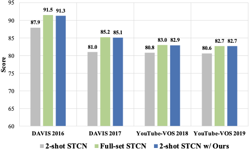
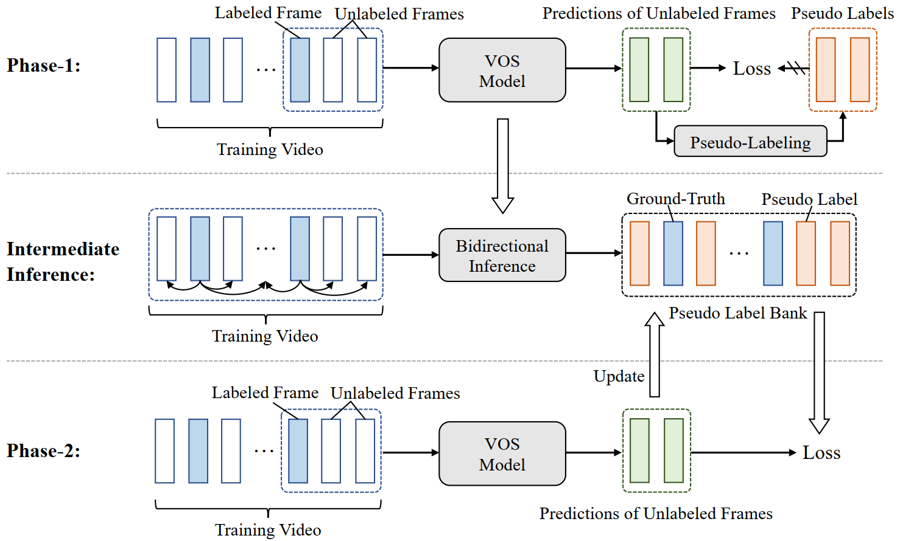

# Two-shot Video Object Segmentation (CVPR2023)
For the first time, we demonstrate the feasibility of two-shot video object segmentation: two labeled frames per video are almost sufficient for training a decent VOS model. 

<div align='center'></div>

In this work, we present a simple yet efficient training paradigm to exploit the wealth of information present in unlabeled frames, with only a small amount of labeled data (e.g. 7.3% for YouTube-VOS and 2.9% for DAVIS), our approach still achieves competitive results in contrast to the counterparts trained on full set (2-shot STCN equipped with our approach achieves 85.1%/82.7% on DAVIS 2017/YouTube-VOS 2019, which is -0.1%/-0.0% lower than the STCN trained on full set). 



This work has been accepted by CVPR 2023.

## Installation

This work follows [STCN](https://github.com/hkchengrex/STCN), please install the running environment and prepare datasets according to the corresponding instructions. Besides, we recommend the version of PyTorch >=1.8.

## Phase-1

Phase-1 aims to train a STCN model using two labeled frames and their adjacent unlabeled frames, the trained STCN model is used to predict initialized pseudo labels for phase-2.

To run phase-1, you can use:
```
sh run_phase1.sh
```

or using commands:

```
CUDA_VISIBLE_DEVICES=0,1 OMP_NUM_THREADS=4 \
  python -m torch.distributed.launch --master_port 9846 --nproc_per_node=2 train.py --stage 3 \
  --id phase1 \
  --load_network ckpts/stcn_s0.pth \
  --yv_data util/yv_rand_2frames.json \
  --davis_data  util/davis_rand_2frames.json \
  --semi \
  --semi_thres_upper 0.9 \
  --end_warm 70000 \
  --use_teacher --ema_alpha 0.995
```

Note,  you can also use only 1 GPU having enough memory, but remember to change the argument `--batch_size` to 2x. 

## Intermediate Inference

This step uses the trained STCN in phase-1 to predict pseudo labels for unlabeled frames. For each of the two labeled frames in a video, the model takes it as the reference frame to infer the predictions for unlabeled frames from the inference frame to the end frame and in a reverse manner. Therefore, you need to run two times for each labeled frame, and four times per video.

To run intermediate inference, you can use the scripts in `run_youtube_phase2` for YouTube-VOS dataset or `run_davis_phase2` for DAVIS dataset respectively. Taking YouTube-VOS as an example, you need to run commands as follows:

```
sh run_youtube_phase2/run_eval_youtube_phase2_left.sh
sh run_youtube_phase2/run_eval_youtube_phase2_leftsecgt.sh
sh run_youtube_phase2/run_eval_youtube_phase2_right.sh
sh run_youtube_phase2/run_eval_youtube_phase2_rightsecgt.sh
```

Then, you need to merge all predictions as:

```
cd phase2_scripts
python merge_left_right.py
```

## Phase-2

You can train various VOS methods in phase-2 as it is originally trained through supervised learning, except you need to update pseudo labels for unlabeled frames during training. 

To run phase-2, you can use:

```
sh run_phase2.sh
```

or using commands:

```
CUDA_VISIBLE_DEVICES=0,1 OMP_NUM_THREADS=4 \
  python -m torch.distributed.launch --master_port 9846 --nproc_per_node=2 train.py --stage 3 \
  --id phase2 \
  --load_network saves/stcn_s0.pth\
  --yv_data util/yv_rand_2frames.json \
  --davis_data  util/davis_rand_2frames.json \
  --phase2_yv ../vos_phase2/phase1_merge_480p \
  --phase2_davis ../vos_phase2/phase1_merge_davis \
  --phase2_train 0 --phase2_thres 0.99 --phase2_start_update 70000
```

You need to indicate the pseudo-label path predicted by intermediate inference using `--phase2_yv` and `--phase2_davis` for YouTube-VOS and DAVIS respectively.

## Citation

Please cite our paper if you find this repo useful! Thx! 

```
@inproceedings{two-shot-vos,
  title={Two-shot Video Object Segmentation},
  author={Yan, Kun and Li, Xiao and Wei, Fangyun and Wang, Jinglu and Zhang, Chenbin and Wang, Ping and Lu, Yan},
  booktitle={CVPR},
  year={2023}
}
```


You can find our paper [here](https://arxiv.org/abs/2303.12078).


