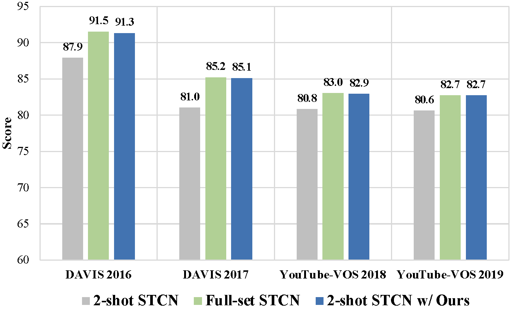

# Two-shot Video Object Segmentation
For the first time, we demonstrate the feasibility of two-shot video object segmentation: two labeled frames per video are almost sufficient for training a decent VOS model. 

In this work, we present a simple yet efficient training paradigm to exploit the wealth of information present in unlabeled frames, with only a small amount of labeled data (e.g. 7.3% for YouTube-VOS and 2.9% for DAVIS), our approach still achieves competitive results in contrast to the counterparts trained on full set (2-shot STCN equipped with our approach achieves 85.1%/82.7% on DAVIS 2017/YouTube-VOS 2019, which is -0.1%/-0.0% lower than the STCN trained on full set). 

This work has been accepted by CVPR 2023.

